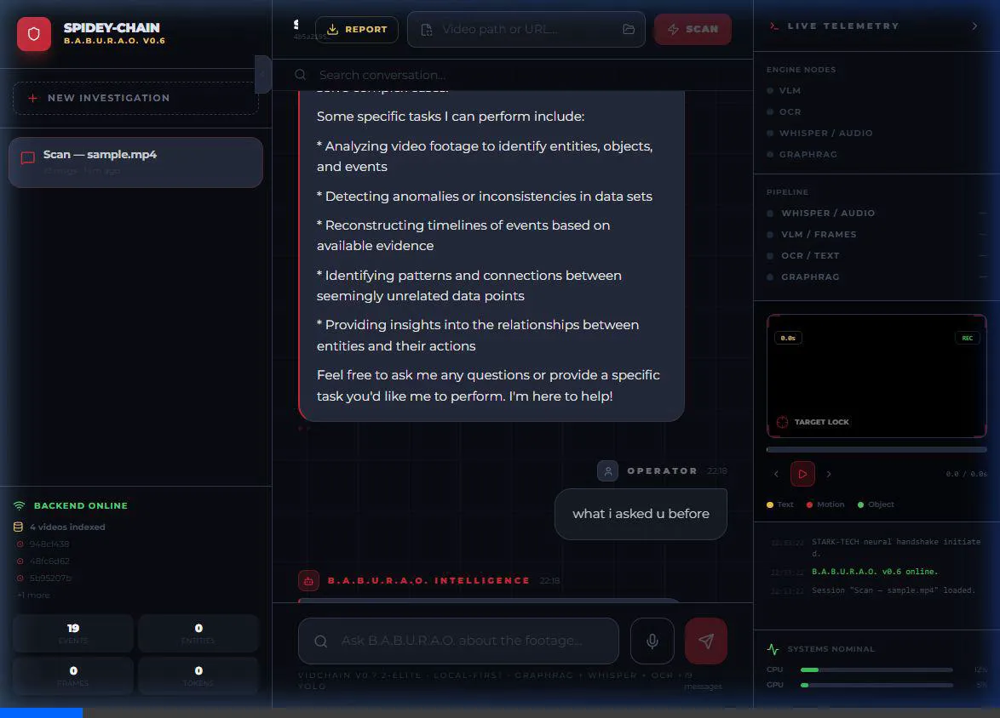
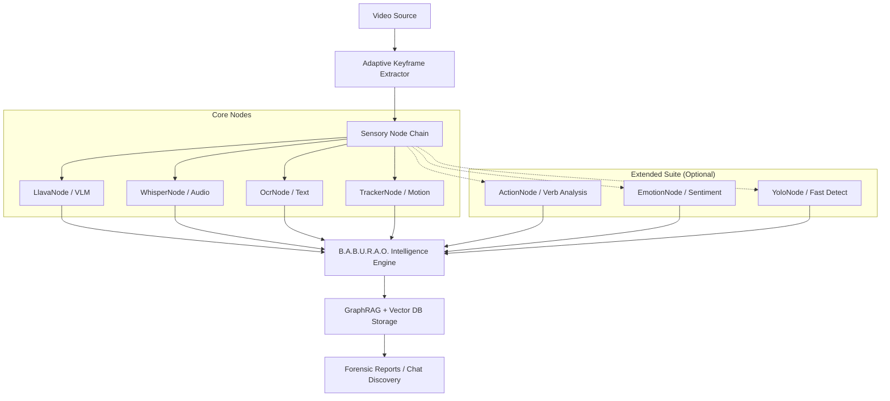

# VidChain: The "LangChain for Videos"
> **v0.8.0-Stable** — Edge-optimized, local-first multimodal RAG framework for forensic video intelligence. Compose modular nodes into custom pipelines, deploy as a microservice, or query via the **Spider-Net Intelligence Portal**.

   



---

## 🏗️ Composable Modular Architecture (Nodes & Chains)

VidChain v0.8.0-Stable introduces a major architectural pivot: the **Nodes & Chains** framework. Instead of a monolithic processor, the system now orchestrates independent, specialized "Sensory Nodes" into a custom forensic chain.



---

## 🧠 Intelligence Layer: B.A.B.U.R.A.O.
The **Behavioral Analysis & Broadcasting Unit for Real-time Artificial Observation** (B.A.B.U.R.A.O.) acts as the cognitive router for VidChain.

- **VLM-First Core**: Uses modular Vision Language Models (Moondream/LLaVA) for dense scene semantics (*"Subject is wearing a dark hoodie and typing on a silver Macbook"*).
- **Temporal Knowledge Graph**: Tracks entities (people, objects, OCR text) and their relationships across time.
- **Recursive Map-Reduce Summarization**: Generates high-fidelity forensic executive summaries for long-form video evidence.

---

## 🛠️ Installation & v0.8 Deployment

```bash
# Install the core framework
pip install vidchain

# Setup local AI backends (Ollama)
ollama pull moondream   # Optimized Edge VLM (1.7GB)
ollama pull llama3      # LLM Reasoner (4.7GB)

# Verify Hardware Readiness (NVIDIA RTX 30-series recommended)
python -m vidchain.scripts.check_gpu
```

---

## 🚀 Quick Start: v0.8 Forensic CLI

v0.8 introduces a stabilized "Neural Handshake" CLI for rapid intelligence scanning.

```bash
# HIGH-FIDELITY SCAN (VLM + Whisper + OCR + Summary)
python -m vidchain.cli surveillance.mp4

# FAST SCAN (YOLOv8 — ideal for high-speed CCTV reviews)
python -m vidchain.cli surveillance.mp4 --fast

# BEHAVIORAL SCAN (Injects Emotion & Action nodes)
python -m vidchain.cli surveillance.mp4 --emotion --action

# SINGLE-SHOT FORENSIC QUERY
python -m vidchain.cli surveillance.mp4 --query "identify the serial number on the device"
```

---

## 📦 Sensory Node Suite

| Tier | Node | Description |
| :--- | :--- | :--- |
| **CORE** | `AdaptiveKeyframeNode` | **Compute Firewall**: Skips identical frames to save GPU load. |
| **CORE** | `LlavaNode` | **Deep Vision**: Contextual scene captioning (LLaVA/Moondream). |
| **CORE** | `WhisperNode` | **Audio Trace**: Time-aligned speech-to-text forensics. |
| **CORE** | `OcrNode` | **Digital Trace**: Screen text and document extraction. |
| **CORE** | `TrackerNode` | **Persistence**: Motion flow and subject tracking. |
| **EXTENDED** | `ActionNode` | **Verbs**: Situational analysis (Emergency, Suspicious, Violence). |
| **EXTENDED** | `EmotionNode` | **Sentiment**: Behavioral emotional analysis (Surprise, Agitation). |
| **EXTENDED** | `YoloNode` | **Velocity**: Ultra-fast object detection alternative to VLM. |

---

## 🕸️ Spider-Net Intelligence Portal
Launch the full web dashboard for professional-grade forensic review, including the **Evidence Vault** and **Neural HUD Telemetry**.

```bash
# Start the Edge Server + Web UI
vidchain-serve
```

---

## ⚖️ Technical comparison (SOTA 2025)
VidChain is uniquely positioned as a **Local-First, Edge-Optimized** framework, outperforming industry black-box VLMs in forensic stability through **Multi-Sensor Serialization**. See [RESEARCH_COMPARISON.md](./RESEARCH_COMPARISON.md) for detailed academic comparisons.

---

## Author
**Rahul Sharma** — IIIT Manipur  
*SEM Project Submission Version 0.8.0-Stable*