# VidChain: The "LangChain for Videos"
> **v0.8.8-Stable** — The Definitive Forensic Intelligence Release. Optimized for speed, integrity, and responsiveness on the seminar floor.

    [](https://pypi.org/project/VidChain/)


---

## High-Integrity Forensic Architecture

VidChain v0.8.8-Stable is powered by the **B.A.B.U.R.A.O. Engine** (Behavioral Analysis & Broadcasting Unit for Real-time Artificial Observation). This version introduces the **Forensic Integrity Hub** and **Snappy Ingest** optimizations.

```mermaid
graph TD
    %% --- Ingestion Stage ---
    subgraph "1. Ingestion & Optimization Layer"
        VS[Video Source] --> AK[Adaptive Gaussian Filter]
        AK -- "Delta > Threshold" --> PK[Promote to Keyframe]
        AK -- "Redundant" --> DROP{{GPU Compute Firewall}}
    end

    %% --- Inference Stage ---
    subgraph "2. Sensory Node Matrix (Late Fusion)"
        PK --> VLM[LlavaNode: Scene Semantics]
        PK --> ASR[WhisperNode: Audio Trace]
        PK --> OCR[OcrNode: Digital Trace]
        PK --> TRK[TrackerNode: Motion Flow]
        
        %% Optional Sensors
        PK -.-> ACT[ActionNode: Situational Verbs]
        PK -.-> EMT[EmotionNode: Sentiment]
    end

    %% --- Intelligence Logic ---
    subgraph "3. B.A.B.U.R.A.O. Cognitive Engine"
        VLM & ASR & OCR & TRK & ACT & EMT --> FUSE[Semantic Fusion Pipeline]
        FUSE --> RDN[Recursive Map-Reduce Summarizer]
    end

    %% --- Persistence ---
    subgraph "4. Forensic Memory Vault"
        FUSE --> KV[(ChromaDB Vector Store)]
        FUSE --> KG[[Temporal Knowledge Graph]]
    end

    %% --- Interaction Stage ---
    subgraph "5. Spider-Net Intelligence Portal"
        USER[User Query] --> IR{Intent Router}
        IR -- "Forensic Search" --> RAG[RAG Retrieval Loop]
        IR -- "Executive Overview" --> RDN
        RAG <--> KV
        RAG <--> KG
        RDN --> REPORT([Intelligence Report])
        RAG --> DISCOVERY([Discovery Hub])
    end

    %% --- Hardware Loop ---
    HM[NVML Hardware Monitor] -.-> AK
    HM -.-> VLM
    HM -.-> DISCOVERY

    style VS fill:#1e1e2e,stroke:#74c7ec,stroke-width:2px;
    style DISCOVERY fill:#11111b,stroke:#a6e3a1,stroke-width:3px;
    style REPORT fill:#11111b,stroke:#a6e3a1,stroke-width:3px;
    style DROP fill:#313244,stroke-dasharray: 5 5;
    style AK fill:#1e1e2e,stroke:#fab387;
```



---

## Key Features (v0.8.8 Evolution)

### Snappy Ingest Optimization [NEW]
Ingestion is now up to 50% faster. By shifting intelligence summarization from a mandatory post-ingest task to an on-demand chat feature, the system marks evidence as **READY** the millisecond the sensor nodes finish processing.

### Forensic Integrity Lock
Strict session-to-video binding. B.A.B.U.R.A.O. now cleans its active memory during every context switch, ensuring zero leakage or "random noises" between investigations.

### Flex-Engine Responsive HUD
The Spider-Net Portal now features a collapsible Telemetry HUD and responsive Ingest Bar, ensuring a clean layout on any screen size from laptops to forensic monitors.

### Precision Evidence Player
A surgical forensic review tool with frame-by-frame 33ms seeking, real-time semantic heatmap overlays, and hardware-accelerated local media resolution.

---

## Installation

```bash
# Core installation
pip install VidChain

# Setup local AI backends (Ollama)
ollama pull moondream   # Optimized Edge VLM (1.7GB)
ollama pull llama3      # Local Reasoning Hub (4.7GB)

# Verify Hardware Readiness (Bundled utility)
python -m vidchain.scripts.check_gpu
```

---

## 📜 Changelog (The Seminar Milestone)
- **v0.8.8**: **Snappy Ingest**. Decoupled auto-summarization from the ingest pipeline for 2x speed.
- **v0.8.7**: **Flex-Engine Layout**. Collapsible HUD, responsive status bar, and UI collision fixes.
- **v0.8.6**: **Forensic Integrity Hub**. Removed dangerous global fallbacks; enforced strict session isolation.
- **v0.8.5**: **Forensic Flow Restoration**. Fixed 404 media reloads and improved rename input UX.
- **v0.8.3**: **Relative Path Migration**. Fixed broken production fetches and asset routing.
- **v0.8.1**: Implemented **Auto-Launch** browser integration for `vidchain-serve`.
- **v0.8.0**: **The Modular Revolution**. Deprecated monolithic processors for Node framework.

---

## Author
**Rahul Sharma** — IIIT Manipur  
*SEM Project Version 0.8.8-Stable*