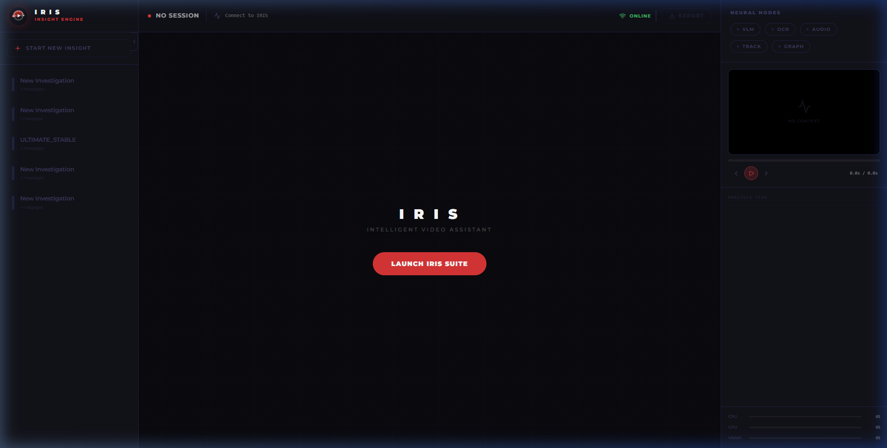

# VidChain: The "LangChain for Videos"
> **v0.9.1-Stable** — Featuring the **Neural Lens** for forensic visual evidence. A high-fidelity, local-first multimodal RAG framework for surgical video intelligence.

    [](https://pypi.org/project/VidChain/)



---

## High-Integrity Neural Architecture

VidChain is powered by the **IRIS Engine** (Intelligent Retrieval & Insight System). This engine fuses visual, auditory, and temporal data into a queryable intelligence layer, providing high-fidelity video summarization and insights.

```mermaid
graph TD
    %% --- Ingestion Stage ---
    subgraph "1. Ingestion & Optimization Layer"
        VS[Video Source] --> AK[Adaptive Gaussian Filter]
        AK -- "Delta > Threshold" --> PK[Promote to Keyframe]
        AK -- "Redundant" --> DROP{{Neural Compute Firewall}}
    end

    %% --- Inference Stage ---
    subgraph "2. Sensory Node Matrix (Late Fusion)"
        PK --> VLM[LlavaNode: Scene Semantics]
        PK --> ASR[WhisperNode: Audio Trace]
        PK --> OCR[OcrNode: Digital Trace]
        PK --> TRK[TrackerNode: Motion Flow]
    end

    %% --- Intelligence Logic ---
    subgraph "3. IRIS Cognitive Engine"
        VLM & ASR & OCR & TRK --> FUSE[Spatio-Temporal Fusion]
        FUSE --> RDN[Recursive Map-Reduce Summarizer]
    end

    %% --- Persistence ---
    subgraph "4. VidChain Memory Vault"
        FUSE --> KV[(ChromaDB Vector Store)]
        FUSE --> KG[[Isolated Knowledge Graph]]
    end

    %% --- Interaction Stage ---
    subgraph "5. IRIS Intelligence Agent"
        USER[User Query] --> IR{Intent Router}
        IR -- "Insight Search" --> RAG[GraphRAG Retrieval Loop]
        RAG <--> KV
        RAG <--> KG
        RAG --> DISCOVERY([VidChain Insight Canvas])
    end

    style VS fill:#1e1e2e,stroke:#74c7ec,stroke-width:2px;
    style DISCOVERY fill:#11111b,stroke:#e8192c,stroke-width:3px;
```



---

## Developer SDK: Building a Custom IRIS Pipeline

VidChain is built on a modular "Node & Chain" architecture. You can assemble surgical intelligence pipelines by combining specific sensory nodes.

### Example: High-Sensitivity Surveillance Audit
This example demonstrates how to build a custom pipeline that prioritizes motion tracking and OCR (digital trace) extraction.

```python
from vidchain import VidChain
from vidchain.pipeline import VideoChain
from vidchain.nodes import (
    AdaptiveKeyframeNode, 
    LlavaNode, 
    OcrNode, 
    TrackerNode
)

# 1. Initialize the IRIS Engine
vc = VidChain(db_path="./surveillance_vault")

# 2. Assemble a Custom Sensory Chain
surveillance_chain = VideoChain(nodes=[
    AdaptiveKeyframeNode(change_threshold=1.5), # High sensitivity
    LlavaNode(model="moondream"),              # Scene semantics
    OcrNode(),                                 # Digital trace extraction
    TrackerNode()                              # Spatio-temporal motion flow
])

# 3. Execute the Pipeline
metadata = vc.ingest(
    video_path="gate_camera_04.mp4", 
    chain=surveillance_chain
)

# 4. Perform Surgical Reasoning
query = "Was there any vehicle with a visible license plate after 14:00?"
response = vc.query(query, session_id="gate_audit_01")

print(f"\nIRIS Intelligence Report:\n{response['text']}")
```

### Core Sensory Nodes
| Node | Modality | Best For |
| :--- | :--- | :--- |
| `LlavaNode` | Visual | Scene semantics, object descriptions, behavioral analysis. |
| `WhisperNode` | Audio | Speech-to-text, acoustic anomaly detection. |
| `OcrNode` | Text | Reading license plates, screens, and documents. |
| `TrackerNode` | Motion | Persistent object tracking and co-occurrence mapping. |
| `AdaptiveKeyframeNode` | Logic | Gaussian-differential sampling to reduce GPU load. |

---

## Key Features (v0.9 Evolution)

### IRIS: The Intelligent Assistant
The v0.9 milestone introduces **IRIS**, a friendly and smart AI assistant that helps users understand their video content. IRIS handles natural language queries, complex reasoning, and executive summaries.

### Isolated GraphRAG Intelligence
Every VidChain "Insight Session" now generates a dedicated, persistent knowledge graph. 
- **Neural Isolation**: Zero leakage between sessions.
- **Entity Tracking**: Deep co-occurrence tracking across the video timeline.
- **Secure Purge**: Physically wipes all associated neural artifacts on deletion.

### VidChain Media Gateway
No more broken paths. VidChain now features a dedicated streaming gateway that resolves absolute local paths, enabling high-fidelity playback of MKV, MP4, and AVI files.

### The Neural Lens (v0.9.1 Upgrade)
IRIS now provides visual proof for her findings.
- **Forensic Snapshots**: Automatic frame extraction for every search query.
- **Evidence Polaroids**: Interactive, high-contrast evidence cards in the chat hub.
- **Neural HUD**: Real-time, chapter-level progress tracking during deep summarization.
- **Infinite Patience**: Robust 900s neural timeout handling for massive forensic files.

---

## Setup & Installation

```bash
git clone https://github.com/rahulsiiitm/videochain-python
cd videochain-python
pip install -e .

# Pull Neural Weights (Ollama)
ollama pull moondream   # Scene Semantics
ollama pull llama3      # Reasoning Hub

# Start the Suite
vidchain-serve
```

---

## Detailed Evolution (v0.8 to v0.9)

### v0.9.1 (The Neural Lens Release)
- **Visuals**: Implemented the "Neural Lens" for automatic forensic snapshot extraction.
- **HUD**: Integrated real-time, chapter-level status updates (Neural HUD) into the Chat Hub.
- **Stability**: Implemented Infinite Patience logic with 900s timeouts for large-scale summarization.
- **Logic**: Upgraded to Agentic Router v2, purging legacy keyword-based chitchat triggers.

### v0.9.0 (The Insight Release)
- **Architecture**: Implemented Neural Isolation for per-session knowledge graphs.
- **Media**: Introduced the VidChain Media Gateway for absolute Windows path streaming.
- **Persona**: Fully integrated IRIS as the primary interaction agent.
- **UI**: High-fidelity custom modals for memory purging.

### v0.8.8 (The Speed Milestone)
- **Optimization**: Snappy Ingest protocol. Decoupled auto-summarization from ingestion.
- **Logic**: Implemented recursive map-reduce for long-video summarization.

---

## Author
**Rahul Sharma** — IIIT Manipur  
*SEM Project Phase 0.9.1-Stable*