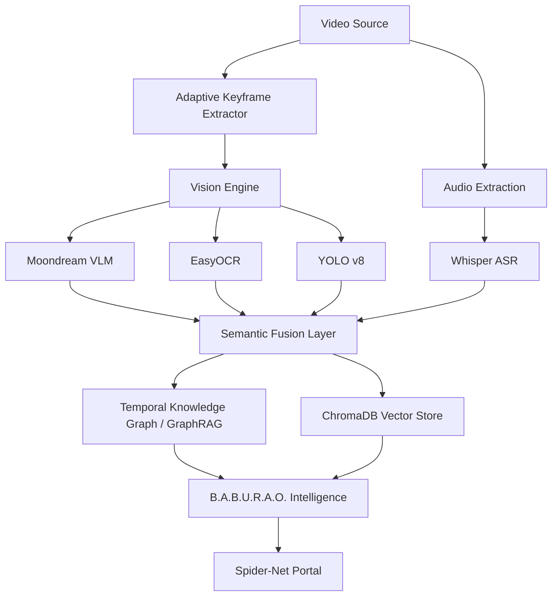

# VidChain: The "LangChain for Videos"
> Edge-optimized, local-first multimodal RAG framework for forensic video intelligence — compose modular nodes into custom pipelines, deploy as a microservice, or query via the **Spider-Net Intelligence Portal**.

    [](https://pypi.org/project/VidChain/)


---

## Diagnostic Architecture

VidChain v0.7.2 follows a **Multimodal Sensor Fusion** architecture, orchestrating specialized AI nodes into a unified forensic timeline.



---

## Overview

VidChain v0.7.2 is a modular, composable framework for on-device multimodal video understanding. Inspired by LangChain's node-based design, it lets developers snap together processing components — Vision Language Models, Audio, OCR — into custom pipelines running entirely on your local GPU.

**VLM-First by design** — Moondream runs by default, delivering rich contextual descriptions (*"a red Honda Civic with a dented bumper"*) instead of blind YOLO tags (*"car"*). Use `--fast` for legacy YOLO when speed matters on long videos.

### 🧠 Intelligence Layer: GraphRAG
VidChain v0.7.2 introduces **Temporal Knowledge Graphs**. While standard RAG searches for disjoint frames, GraphRAG maps entities (people, laptops, OCR text) and their relationships across time.

- **Entity Persistence:** Automatically tracks when a person or object was first/last seen.
- **Cross-Video Tracking:** Maps co-occurrences (e.g., "Person A and Person B appeared together at 12s").
- **Forensic Deductions:** Merges VLM descriptions with OCR text for high-fidelity evidence reconstruction.

---

### 🕸️ Spider-Net Intelligence Portal (Web)
A professional-grade forensic command center for real-time video intelligence and investigative discovery. **Now bundled natively within the Python package.**
`vidchain-serve`

- **Unified Launch**: Hosting both the B.A.B.U.R.A.O. API and the full web dashboard on `localhost:8000`.
- **Forensic Evidence Vault**: Integrated media engine with **33ms frame-step** precision (`[<]` and `[>]` controls).
- **Neural HUD & Heatmap**: Real-time visualization of sensor activity and intelligence density.
- **Zero-Config Dashboard**: Served as a high-performance static bundle directly from the Python core.

---

## What's New in v0.5.0 🚀

### Composable Node Architecture
VidChain now works like LangChain — build your own pipelines by snapping together modular nodes:

```python
from vidchain import VidChain
from vidchain.pipeline import VideoChain
from vidchain.nodes import YoloNode, WhisperNode, OcrNode, AdaptiveKeyframeNode
from vidchain.nodes import LlavaNode  # New: Vision Language Model node

# Build a fully custom pipeline
my_chain = VideoChain(nodes=[
    AdaptiveKeyframeNode(change_threshold=5.0),  # Skip identical frames
    LlavaNode(model_name="moondream"),           # Deep scene captioning
    WhisperNode(),                               # Speech transcription
    OcrNode(),                                   # Screen text extraction
])

vc = VidChain()
video_id = vc.ingest("surveillance.mp4", chain=my_chain)
print(vc.ask("Was anyone at the desk?"))
```

### VLM Vision Node (`LlavaNode`)
Replace blind YOLO object tags with rich, contextual scene descriptions powered by a local Vision Language Model:

- **Before (YOLO):** `"1 person, 1 laptop"`
- **After (LlavaNode):** `"A person is typing Python code in VS Code. A terminal window is open showing a running script. The screen displays file explorer with project files visible."`

Supports any Ollama-compatible VLM model (recommended: `moondream` for speed, `llava:7b` for detail).

### Adaptive Keyframe Firewall
The `AdaptiveKeyframeNode` acts as a compute firewall. It computes a Gaussian-blurred frame delta to detect visual change — identical frames are instantly rejected before reaching heavy models like YOLO or LLaVA, dramatically reducing GPU load.

### FastAPI Edge Server (`vidchain-serve`)
Deploy VidChain as a local microservice accessible from any app or language:

```bash
# Terminal 1: Start the Edge Server
vidchain-serve

# Terminal 2: Ingest + Query via REST API
Invoke-RestMethod -Uri "http://localhost:8000/api/ingest" -Method Post -ContentType "application/json" -Body '{"video_source": "sample.mp4"}'
Invoke-RestMethod -Uri "http://localhost:8000/api/query" -Method Post -ContentType "application/json" -Body '{"query": "Summarize the video"}'
```

Interactive Swagger UI available at **http://localhost:8000/docs**

---

## Installation

```bash
pip install vidchain

# GPU-accelerated PyTorch (recommended)
pip install torch torchvision torchaudio --index-url https://download.pytorch.org/whl/cu121 --force-reinstall

# For LlavaNode (VLM support)
# Install Ollama: https://ollama.com
ollama pull moondream   # Fast edge VLM (~1.7GB, fits 4GB VRAM)
ollama pull llava       # High quality VLM (~4.7GB, requires 8GB+ VRAM)
```

> Run `python scripts/check_gpu.py` to verify CUDA is detected.

---

## Quick Start

### Python API (Library)

```python
from vidchain import VidChain

# Initialize
vc = VidChain(config={
    "llm_provider": "ollama/llama3",   # Fully offline
    "db_path": "./vidchain_storage"
})

# Ingest a video (uses legacy YOLO pipeline by default)
video_id = vc.ingest("surveillance.mp4")

# Query
print(vc.ask("what happened in the video?"))
print(vc.ask("was anyone acting suspiciously?"))

# Multi-video: scope query to a specific video
vc.ingest("cam1.mp4", video_id="cam1")
vc.ingest("cam2.mp4", video_id="cam2")
print(vc.ask("did anyone enter the room?", video_id="cam1"))
```

### Composable Node Pipeline

```python
from vidchain import VidChain
from vidchain.pipeline import VideoChain
from vidchain.nodes import AdaptiveKeyframeNode, LlavaNode, WhisperNode

# Build a VLM-powered pipeline with adaptive keyframing
chain = VideoChain(
    nodes=[
        AdaptiveKeyframeNode(change_threshold=5.0),
        LlavaNode(model_name="moondream"),
        WhisperNode(),
    ],
    frame_skip=15  # 2 FPS extraction
)

vc = VidChain()
vc.ingest("video.mp4", chain=chain)
print(vc.ask("describe what is on the screen"))
```

### CLI

```bash
# Default: Moondream VLM pipeline (rich descriptions)
vidchain-analyze video.mp4

# Single-shot query with VLM
vidchain-analyze video.mp4 --query "describe the car in detail"

# Switch VLM model (e.g. LLaVA for higher quality)
vidchain-analyze video.mp4 --vlm llava --query "what brand is the laptop?"

# Fast mode: Legacy YOLO pipeline (for long videos where speed > detail)
vidchain-analyze video.mp4 --fast

# Start Unified Forensic Suite (API + Spider-Net Portal)
vidchain-serve

# Launch Legacy Desktop UI (Local)
vidchain-studio

# Train Custom Action Engine
vidchain-train
```

---

## Available Nodes

| Node | Description |
|---|---|
| `YoloNode` | YOLOv8 object detection — outputs class labels and counts |
| `WhisperNode` | Whisper speech-to-text transcription |
| `OcrNode` | EasyOCR screen text extraction (triggered on readable surfaces) |
| `ActionNode` | MobileNetV3 action intent classification (NORMAL/SUSPICIOUS/VIOLENCE) |
| `LlavaNode` | Ollama VLM node — deep contextual scene captioning (NEW in v0.5.0) |
| `AdaptiveKeyframeNode` | Frame-delta firewall — skips visually identical frames (NEW in v0.5.0) |

---

## Core Pipeline (Legacy)

```
Video → WAV Extraction → Whisper ASR → Frame Loop →
  ├── YOLO (Objects)
  ├── MobileNetV3 (Action)
  ├── EasyOCR (Screen Text)
  ├── DeepFace (Emotion, threaded)
  └── TemporalTracker (Object Persistence + Camera Motion)
→ Semantic Fusion → ChromaDB → B.A.B.U.R.A.O. RAG
```

---

## Tech Stack

| Component | Technology |
|---|---|
| Object Detection | YOLOv8s (Ultralytics) |
| VLM Vision | LLaVA / Moondream (via Ollama) — NEW |
| Action Classification | MobileNetV3 (custom fine-tuned) |
| Speech Recognition | OpenAI Whisper (base) |
| OCR | EasyOCR |
| Emotion Analysis | DeepFace (opencv backend) |
| Temporal Tracking | IoU tracker + Lucas-Kanade optical flow |
| Embedder | `BAAI/bge-base-en-v1.5` |
| Reranker | `cross-encoder/ms-marco-MiniLM-L-6-v2` |
| Vector Store | ChromaDB (persistent) |
| LLM Routing | LiteLLM (`ollama/llama3` default, Gemini supported) |
| Edge API | FastAPI + Uvicorn — NEW |
| GPU Runtime | CUDA 12.1 (4GB+ VRAM, RTX 30-series tested) |

---

## Developer Utilities

```python
# List all indexed videos
vc.list_indexed_videos()

# Generate a narrative summary
vc.summarize_video(video_id, depth="concise")  # or "detailed"

# Hot-swap LLM
vc.set_llm("ollama/llama3")

# Purge a specific video
vc.purge_storage(video_id="cam1")

# Purge everything
vc.purge_storage()
```

---

## Roadmap

- [x] **Dual-Brain Vision Engine** — YOLO + MobileNetV3 (v0.2.0)
- [x] **CLIP scene understanding** — zero-shot environment classification (v0.3.0)
- [x] **Adaptive audio filtering** — energy gating, anomaly detection (v0.3.0)
- [x] **Multi-video scoped queries** (v0.3.0)
- [x] **Composable Node Architecture** — LangChain-style pipelines (v0.5.0)
- [x] **VLM Node** — LLaVA/Moondream contextual captioning (v0.5.0)
- [x] **Adaptive Keyframe Firewall** — GPU compute optimization (v0.5.0)
- [x] **FastAPI Edge Microservice** — `vidchain-serve` (v0.5.0)
- [x] **VLM-First default pipeline** — Moondream as default, YOLO via `--fast`
- [x] **Spider-Net Intelligence Portal** — High-fidelity forensic web dashboard (v0.7.2)
- [x] **Forensic Evidence Vault** — Precision frame-step video review system (v0.7.2)
- [x] **Cognitive Bridge** — Real-time sensor telemetry & Neural HUD (v0.7.2)

## [0.7.2] — 2026-04-19
### Added
- **Spider-Net Portal**: Next.js-based forensic command center.
- **Neural HUD**: Real-time sensor indicators (VLM/OCR/Audio).
- **Evidence Vault**: surgical seeking and metadata-anchored playback.
- **Cognitive Bridge**: Live polling of backend forensic nodes.

## [0.6.0] — 2026-04-18
### Added
- **GraphRAG Engine:** Temporal Knowledge Graph (NetworkX) for multi-hop forensic reasoning.
- **Persistent Intelligence:** Graphs now save to `knowledge_graph.pkl` alongside ChromaDB.
- **VidChain Studio:** Native Desktop UI with live server monitoring and interactive chat.
- **B.A.B.U.R.A.O. 2.0:** Refined system persona as an "Intelligent Video Storyteller".
- **Modular Nodes:** Official `OcrNode` and `ActionNode` for customizable pipelines.

### Fixed
- **Timeline Drift:** Resolved "Stall Bug" where skipped frames would cause timestamp misalignment.
- **Scaling Errors:** Fixed UI scaling issues on High-DPI Windows displays in Studio.
- **Unicode Support:** Sanitized CLI outputs for better compatibility with Windows terminals.

---

## Contributing

Contributions, issues, and feature requests are welcome. Open a GitHub issue or submit a pull request.

---

## Author

**Rahul Sharma** — B.Tech CSE, IIIT Manipur

## License

Distributed under the [MIT License](LICENSE).