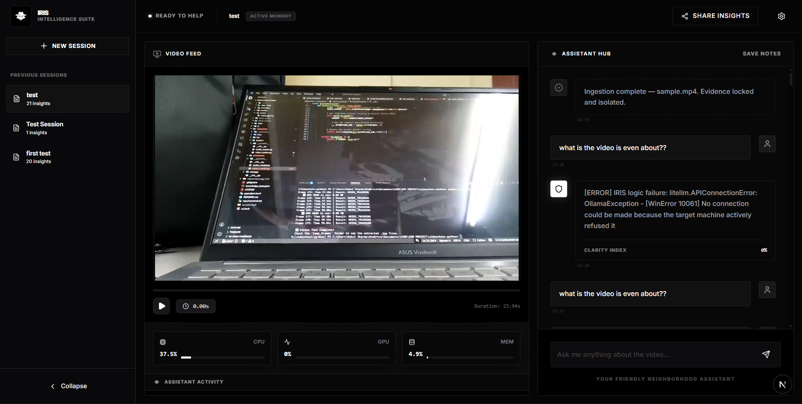

# VidChain: High-Fidelity Multimodal RAG Framework
> **v1.0.0-Stable** — A local-first multimodal Retrieval-Augmented Generation (RAG) framework for forensic video intelligence.

    [](https://pypi.org/project/VidChain/)



---

## System Overview

VidChain is powered by the **IRIS Engine** (Intelligent Retrieval & Insight System). The framework parses video files through a modular sensory matrix, fusing visual, auditory, digital (OCR), and temporal data into a queryable intelligence layer. It is designed for forensic analysis, security auditing, and automated video summarization with strict local-hardware privacy constraints.

```mermaid
graph TD
    %% --- Ingestion Stage ---
    subgraph "1. Ingestion & Optimization Layer"
        VS[Video Source] --> AK[Adaptive Gaussian Filter]
        AK -- "Delta > Threshold" --> PK[Promote to Keyframe]
        AK -- "Redundant" --> DROP{{Neural Compute Firewall}}
    end

    %% --- Inference Stage ---
    subgraph "2. Sensory Node Matrix (Late Fusion)"
        PK --> VLM[LlavaNode: Scene Semantics]
        PK --> ASR[WhisperNode: Audio Trace]
        PK --> OCR[OcrNode: Digital Trace]
        PK --> TRK[TrackerNode: Motion Flow]
    end

    %% --- Intelligence Logic ---
    subgraph "3. IRIS Cognitive Engine"
        VLM & ASR & OCR & TRK --> FUSE[Spatio-Temporal Fusion]
        FUSE --> RDN[Recursive Map-Reduce Summarizer]
    end

    %% --- Persistence ---
    subgraph "4. VidChain Memory Vault"
        FUSE --> KV[(ChromaDB Vector Store)]
        FUSE --> KG[[Hybrid Global/Local GraphRAG]]
    end

    %% --- Interaction Stage ---
    subgraph "5. IRIS Intelligence Agent"
        USER[User Query] --> IR{4-Route Intent Router}
        IR -- "1. Narrative" --> SUM[Map-Reduce Summarizer]
        IR -- "2. Forensic" --> RAG[Local GraphRAG]
        IR -- "3. Master Intel" --> GLOBAL[Global Cross-Video RAG]
        IR -- "4. Dialogue" --> CHAT[Conversational Logic]
        SUM & RAG & GLOBAL & CHAT --> DISCOVERY([VidChain Insight Canvas])
    end

    style VS fill:#1e1e2e,stroke:#74c7ec,stroke-width:2px;
    style DISCOVERY fill:#11111b,stroke:#e8192c,stroke-width:3px;
```



## Key Capabilities

- **4-Route Agentic Router**: Optimized intent classification dividing queries into Narrative Summarization, Local Forensic Search, Global Master Intelligence, and Conversational Dialogue.
- **Global Master Intelligence**: Cross-video entity tracking. IRIS builds a macro-graph of entities across isolated sessions, enabling broad pattern recognition and historical lookups.
- **Temporal Persistence**: Sophisticated chronological reasoning. IRIS bridges gaps between frames, recognizing that states persist between active sensor logs.
- **Recursive Map-Reduce Summarizer**: High-density narrative synthesis capable of collapsing hours of video data into coherent, chronological reports without hitting LLM context limits.
- **Neural Concurrency Locking**: Production-hardened safety mechanisms preventing state corruption during simultaneous ingestion and querying tasks.
- **Local-First Privacy**: 100% air-gapped reasoning. Data remains entirely on the host hardware.

## Installation and Deployment

### Prerequisites
- **Python**: 3.11 or higher
- **CUDA**: 12.1 or higher (Required for hardware acceleration)
- **Ollama**: Must be installed and running for local LLM/VLM execution.
- **Node.js**: v18+ (Required for the Next.js Web Portal)

### Installation Steps

1. **Install Core Dependencies**
```bash
pip install torch torchvision torchaudio --index-url https://download.pytorch.org/whl/cu121
```

2. **Install VidChain**
```bash
git clone https://github.com/rahulsiiitm/videochain-python
cd videochain-python
pip install -e .
```

3. **Pull Required Neural Weights**
```bash
ollama pull moondream   # Vision Language Model for scene semantics
ollama pull llama3      # Large Language Model for reasoning and routing
```

### Hardware-Agnostic Engine
VidChain automatically audits hardware during initialization:
- **CUDA Available**: Activates high-fidelity GPU pipelines for real-time analysis.
- **CPU Fallback**: Gracefully degrades to CPU mode with zero code modifications required.

## Command Line Interface (CLI)

VidChain provides several CLI tools for operational flexibility.

### 1. `vidchain-serve`
Launches the FastAPI backend and hosts the Next.js React frontend dashboard.
```bash
vidchain-serve
```
- Hosts the REST API at `http://localhost:8000`.
- Automatically opens the Spider-Net web dashboard in the default browser at `http://localhost:3000`.
- Implements a 7-second "Neural Warmup" to stabilize models before accepting requests.

### 2. `vidchain-analyze`
Executes headless video ingestion and analysis directly from the terminal.
```bash
vidchain-analyze path/to/video.mp4 --vlm moondream
```
- `--fast`: Bypasses the VLM and uses YOLO for high-speed object detection (ideal for long-form CCTV).
- `--emotion`: Injects the DeepFace emotion analysis node.
- `--action`: Injects the MobileNetV3 situational action node.

### Changing the Neural Engines (LLM/VLM)

VidChain uses LiteLLM under the hood, meaning you can hot-swap the underlying AI models directly from the command line depending on your local hardware capabilities:

- **Change Reasoning Engine (LLM)**:
  ```bash
  vidchain-analyze path/to/video.mp4 --llm "ollama/llama3"
  vidchain-analyze path/to/video.mp4 --llm "gemini/gemini-2.5-flash"
  ```
  *(Default is `gemini/gemini-2.5-flash`. **Note**: To use Gemini or other cloud models, you must export your API key as an environment variable, e.g., `export GEMINI_API_KEY="your_api_key"`).*

- **Change Vision Engine (VLM)**:
  ```bash
  vidchain-analyze path/to/video.mp4 --vlm "llava:7b"
  ```
  *(Default is `moondream` via Ollama)*

## Developer SDK: The Modular Sensor Matrix

VidChain utilizes a LangChain-inspired composable architecture. Developers can assemble custom pipelines by chaining specific sensory nodes.

### Core Sensory Nodes

| Node Class | Modality | Primary Application |
| :--- | :--- | :--- |
| `AdaptiveKeyframeNode` | Logic | Gaussian-differential sampling to drop redundant frames and reduce compute load. |
| `LlavaNode` | Visual | High-fidelity scene semantics, descriptive captions, and situational context. |
| `YoloNode` | Visual | High-speed, discrete object detection (fallback for `LlavaNode`). |
| `WhisperNode` | Audio | Speech-to-text transcription and acoustic anomaly detection (e.g., shouts). |
| `OcrNode` | Text | Digital trace extraction (license plates, computer screens, documents). |
| `TrackerNode` | Motion | Persistent object tracking (IoU) and camera motion estimation (Optical Flow). |
| `EmotionNode` | Behavioral | Facial sentiment analysis (requires visible faces). |
| `ActionNode` | Behavioral | High-speed classification of human activities. |

### Basic Usage (Default Pipeline)

The simplest way to integrate VidChain into an existing Python application is to use the default high-fidelity VLM pipeline.

```python
from vidchain import VidChain

# 1. Initialize the IRIS Intelligence Vault
vc = VidChain(db_path="./forensic_vault")

# 2. Ingest Video (Automatically uses AdaptiveKeyframe, Llava, Whisper, etc.)
video_id = vc.ingest(video_source="interview_01.mp4")

# 3. Query the Engine
response = vc.ask("What is the main topic of discussion?", video_id=video_id)
print(response["text"])

# 4. Generate an Executive Summary
summary = vc.summarize_video(video_id=video_id, mode="concise")
print(summary)
```

### SDK Example: Custom Forensic Pipeline

```python
from vidchain import VidChain
from vidchain.pipeline import VideoChain
from vidchain.nodes import (
    AdaptiveKeyframeNode, 
    LlavaNode, 
    OcrNode, 
    TrackerNode
)

# 1. Initialize the Orchestrator
vc = VidChain(db_path="./forensic_vault")

# 2. Assemble a High-Sensitivity Custom Chain
surveillance_chain = VideoChain(nodes=[
    AdaptiveKeyframeNode(change_threshold=1.5), # High sensitivity for subtle movements
    LlavaNode(model="moondream"),              # Scene semantics
    OcrNode(),                                 # Digital trace extraction
    TrackerNode()                              # Spatio-temporal motion mapping
])

# 3. Execute Ingestion
video_id = vc.ingest(
    video_source="gate_camera_04.mp4", 
    chain=surveillance_chain
)

# 4. Perform Agentic Query
query = "Were there any vehicles with visible license plates after 14:00?"
response = vc.ask(query, video_id=video_id)

print(response)
```

## REST API Reference

When running `vidchain-serve`, the system exposes a FastAPI backend for external integrations.

- `GET /api/health`: Returns system status and the list of ingested video IDs.
- `POST /api/sessions`: Creates a new isolated neural session.
- `POST /api/ingest`: Accepts a video file path and initializes background processing.
- `POST /api/query`: Submits a natural language query against a specific session, triggering the Agentic Router.
- `GET /api/media-stream`: Serves absolute local video paths securely for frontend playback.

## Architectural Details

### Isolated GraphRAG Intelligence
Each ingested video generates a dedicated, persistent Temporal Knowledge Graph (`.pkl`). The RAG engine retrieves semantically relevant chunks from ChromaDB and fuses them with structured factual data (co-occurrences, tracking IDs, timestamps) from the graph. Memory boundaries are strictly enforced to prevent cross-video hallucinations.

### The Neural Lens
The system automatically pairs textual answers with Base64-encoded visual snapshots extracted directly from the referenced timestamp. This provides immediate, undeniable visual proof for any AI-generated claim.

---
**Author:** Rahul Sharma — IIIT Manipur  
**License:** MIT  
**Status:** Production / v1.0.0-Stable