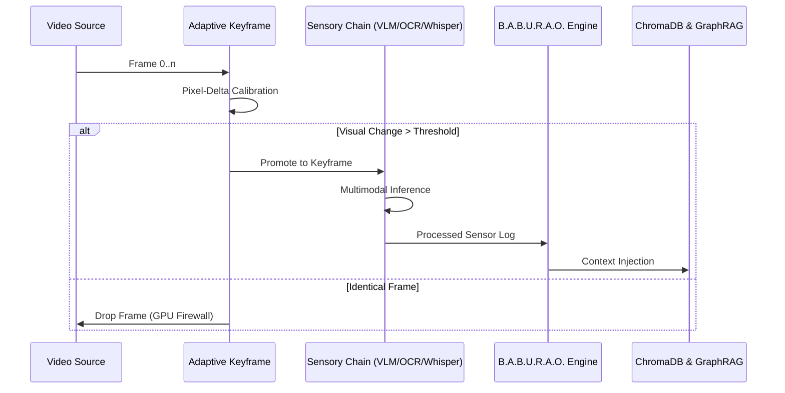

# VidChain: Technical Specifications & Architectural Deep-Dive

## 1. Project Overview
VidChain is a **multimodal RAG (Retrieval-Augmented Generation) framework** designed for forensic video intelligence. It treats video as a queryable database by fusing multiple sensor streams—Visual, OCR, Audio, and Motion—into a unified semantic timeline.

### Core Philosophy: The B.A.B.U.R.A.O. Engine
B.A.B.U.R.A.O. (Behavioral Analysis & Broadcasting Unit for Real-time Artificial Observation) is the intelligence layer that orchestrates sensory data into human-readable narratives.

---

## 2. Technical Architecture

### 2.1 Sensory Node Execution Flow
VidChain orchestrates its modular sensory nodes via a sequential frame-buffer. This allows for late-modal fusion where high-level VLM descriptions are grounded by low-level motion and OCR data.

### 2.2 Sensor Node Architecture (Core vs. Extended)
VidChain uses a **Composable Sensory Chain**. To ensure real-time performance on edge devices (like the RTX 3050), sensors are categorized into a **Precision Core** and an **Extended Suite**.

#### **Core Pipeline (Active by Default)**
These nodes are optimized for speed and forensic fundamentals. They are active in the `VideoChain` by default.

| Node | Technology | Purpose |
| :--- | :--- | :--- |
| **AdaptiveKeyframe** | RGB-Delta Stats | **The Pipeline Firewall**: Only processes frames with >5% visual change. |
| **LlavaNode** | Ollama / LLaVA-v1.5 | **Dense Captioning**: Generates rich natural language scene descriptions. |
| **WhisperNode** | OpenAI Whisper | **Aural Intelligence**: Provides time-aligned forensic speech transcripts. |
| **OcrNode** | EasyOCR | **Digital Trace**: Scrapes ID numbers, text, and labels from the screen. |
| **TrackerNode** | Lucas-Kanade | **Persistence**: Differentiates camera movement from subject movement. |

#### **Extended Suite (Developer-Customizable)**
These nodes are available in `vidchain.nodes` for developers to inject into custom pipelines for deeper behavioral or kinetic analysis.

| Node | Technology | Purpose |
| :--- | :--- | :--- |
| **ActionNode** | MobileNetV3 | **Kinetic Analysis**: Classifies situational "verbs" (Emergency, Violence, Suspicious). |
| **EmotionNode** | DeepFace | **Behavioral Sentiment**: Detects agitation, focus, or distress in subjects. |
| **YoloNode** | Ultralytics YOLOv8 | **Fast Detection**: High-speed object localization (alternative to LlavaNode). |

### 2.1.1 Kinetic Action Profiler (Situation Model)
The ActionNode employs a supervised MobileNetV3 architecture optimized for surveillance. It classifies keyframes into high-level "Verbs" or situational labels:
- **Emergency**: Identification of sirens, accidents, or rapid chaotic movement.
- **Suspicious**: Detection of loitering or perimeter-breach-like behaviors.
- **Normal**: Standard pedestrian/ambient activity.
- **Violence**: Detection of rapid interpersonal conflict interactions.

### 2.2 Knowledge Representation
- **Vector Base**: ChromaDB stores 768-dimensional BGE embeddings of semantic scenes.
- **GraphRAG**: A **Temporal Knowledge Graph** tracks entity relationships across timestamps, allowing the agent to answer questions like "How did the subject's behavior change after the incident?"

---

## 3. Algorithmic Implementation

### 3.1 Adaptive Keyframe Extraction
Instead of processing every frame (30 FPS), VidChain uses a **Temporal Variation Filter**:
$$ \Delta I = \frac{1}{N} \sum | I_t - I_{t-1} | $$
If $\Delta I$ exceeds a dynamic threshold, the frame is promoted to a "Keyframe" and sent to the sensory nodes.

### 3.2 Recursive Map-Reduce Intelligence Reports
To generate professional forensic reports for long-duration footage, VidChain employs a **Map-Reduce Narrative Engine**:
1.  **Map Phase**: The system segments 1,500-word spans of forensic logs (Visual, Audio, OCR).
2.  **Synthesis**: Each span is condensed into a "Temporal Narrative" describing events and entities.
3.  **Recursive Reduction**: Narratives are iteratively merged by the B.A.B.U.R.A.O. engine until a unified **Forensic Executive Summary** is generated.
4.  **Forensic Pass**: A final pass applies professional investigative terminology, highlighting verified timestamps and identified subjects.

### 3.3 Neural Verification Pulse (Confidence)
Every answer generated by B.A.B.U.R.A.O. undergoes a self-evaluation:
- The LLM cross-references its proposed answer with the retrieved sensory log.
- It provides a confidence score (0-100) based on factual density.
- Scores below 40 are flagged as "Inconclusive/Hallucination Risk."

---

## 4. Technology Stack
- **Backend**: Python 3.10+, FastAPI (Edge Server), Uvicorn.
- **AI Models**: Ollama (LLM/VLM), Whisper (Audio), EasyOCR (Text), Sentence-Transformers (Embeddings).
- **Core ML**: PyTorch, OpenCV, ChromaDB, Lucas-Kanade (Motion).
- **Frontend**: Next.js 14, Tailwind CSS, Framer Motion (Real-time HUD).
- **Telemetry**: NVML (NVIDIA Management Library) for live GPU profiling.

---

## 5. Security & Isolation
- **Neural Handshake**: UI sessions are cryptographically isolated.
- **Private Video Context**: Vector retrieval is scoped by `video_id` to prevent cross-video hallucinations.
- **Local-First**: All reasoning happens on the edge to ensure data privacy for forensic evidence.

---

## 6. VidChain v0.8: Command Line Interface (CLI)

The VidChain CLI is optimized for rapid forensic analysis and terminal-based intelligence retrieval.

### Usage Commands
| Command | Mode | Purpose |
| :--- | :--- | :--- |
| `python -m vidchain.cli report <video>` | High-Fidelity | Full VLM-based scene captioning and recursive summary. |
| `python -m vidchain.cli report <video> --fast` | Fast-Scan | Uses YOLOv8 for high-speed object detection (ideal for CCTV). |
| `python -m vidchain.cli report <video> --emotion` | Behavioral | Injects the EmotionNode for behavioral sentiment analysis. |
| `python -m vidchain.cli report <video> --query "..."` | Single-Shot | Direct forensic query without entering interactive chat. |

### Neural Handshake (Interactive Mode)
After ingestion, VidChain enters the **B.A.B.U.R.A.O. Interactive Hub**, allowing for multi-turn temporal reasoning over the indexed forensic logs.

---

## 7. Installation & Deployment

### Resource Requirements
- **Recommended GPU**: NVIDIA RTX 3050 (4GB VRAM) or better.
- **Backend**: Ollama (for LLaVA/Moondream hosting).
- **Python Packages**: `ultralytics`, `deepface`, `openai-whisper`, `chromadb`, `litellm`.

### Deployment as v0.8
1. Initialize the B.A.B.U.R.A.O. orchestration layer.
2. Index raw video assets into the persistent `vidchain_storage`.
3. Launch the Web Portal (Next.js) or the CLI for active forensic review.
